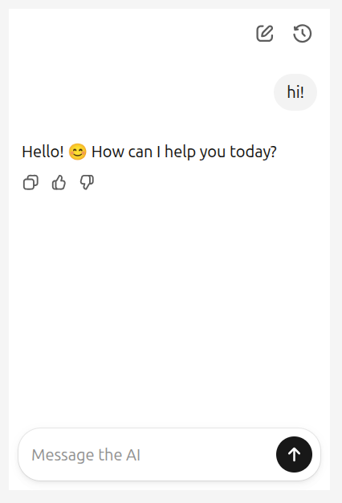

# ChatKit POC

Minimal proof-of-concept for [OpenAI ChatKit](https://platform.openai.com/docs/guides/chatkit) integration with [FastAPI](https://fastapi.tiangolo.com/) sample agent backend.

The sample agent is built using [Strands Agents](https://strandsagents.com/).

Using Langfuse for observability.



## Requirements

- Docker
- Docker Compose
- OpenAI API key (for sample agent backend)

## Setup

```bash
git clone https://github.com/jbaris/poc-chatkit.git
cd poc-chatkit
cp .env.example .env
# Edit .env with your credentials
```

## Run

```bash
docker-compose up
```

## Access

- Frontend: http://localhost:81
- Backend: http://localhost:3001
- Langfuse UI: http://localhost:3000 (user:admin@admin.com, pass:admin123)
